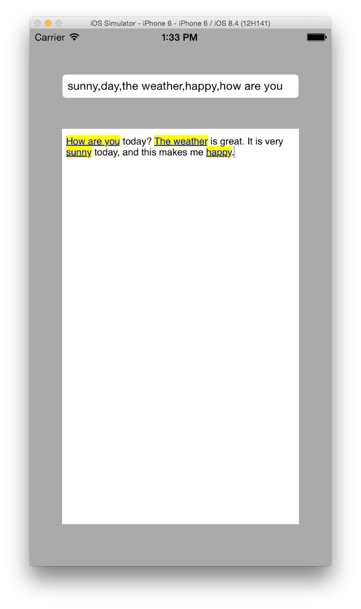

# RichTextEditorExample
A sample project to demonstrate creating a rich text editor that formats a list of tags. The sample app allows you to change a comma delimited list of tags alongside the actual text, and the text is tagged appropriately.

## Motivation
I'm working on a project that requires me to create a tag editor that highlights tags as the user types. This example isn't nearly as polished as my final product will be, however the parsing and formatting logic could be beneficial to someone also looking for this behavior. 

## Sample

## License
Copyright (c) 2015 Clay Tinnell.

Use of the code provided on this repository is subject to the MIT License.

Permission is hereby granted, free of charge, to any person obtaining a copy of this software and associated documentation files (the "Software"), to deal in the Software without restriction, including without limitation the rights to use, copy, modify, merge, publish, distribute, sublicense, and/or sell copies of the Software, and to permit persons to whom the Software is furnished to do so, subject to the following conditions:

The above copyright notice and this permission notice shall be included in all copies or substantial portions of the Software.

THE SOFTWARE IS PROVIDED "AS IS", WITHOUT WARRANTY OF ANY KIND, EXPRESS OR IMPLIED, INCLUDING BUT NOT LIMITED TO THE WARRANTIES OF MERCHANTABILITY, FITNESS FOR A PARTICULAR PURPOSE AND NONINFRINGEMENT. IN NO EVENT SHALL THE AUTHORS OR COPYRIGHT HOLDERS BE LIABLE FOR ANY CLAIM, DAMAGES OR OTHER LIABILITY, WHETHER IN AN ACTION OF CONTRACT, TORT OR OTHERWISE, ARISING FROM, OUT OF OR IN CONNECTION WITH THE SOFTWARE OR THE USE OR OTHER DEALINGS IN THE SOFTWARE.
